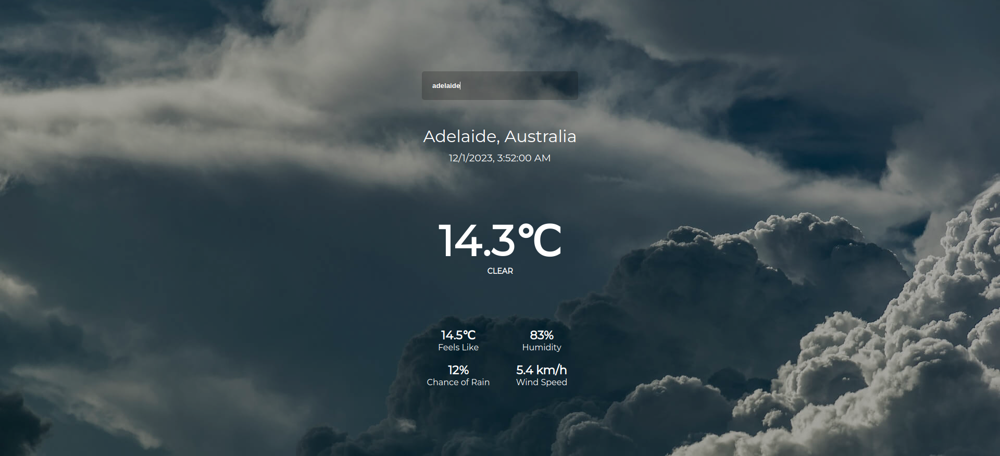

# Weather App



This application allows the user to view general weather information for any location and it is the submission for [The Odin Project: Weather App](https://www.theodinproject.com/lessons/node-path-javascript-weather-app). 

The key features are:

- Real-Time Updates
- Accurate Information
- Cross-Platform Compatibility


## Live Demo

[Weather App](https://jesusgraterol.github.io/weather-top/)


## Getting Started

### Requirements

- GIT
- NodeJS ^v21.0.0
- NPM ^v10.2.0

### Installation

1) Clone the repository
```bash
git clone git@github.com:jesusgraterol/weather-top.git
```

2) Install the dependencies
```bash
npm install
```


## Usage

1) Run the Webpack Build in `watch` mode

```bash
npm run serve
```

2) Open the `./dist/index.html` file with your favorite browser.


## Build Process

1) Run the Webpack Build
```bash
npm run build
```


## Deployment

1) Push the new build to the `gh-pages` branch so it is deployed to **Github Pages**:

```bash
git subtree push --prefix dist origin gh-pages
```


## Built With

- HTML5
- CSS3
- JavaScript
- Webpack


## Running the Tests

```bash
# Unit Tests
N/A

# Integration Tests
N/A

# E2E Tests
N/A
```


## @TODO

N/A


## License

[MIT](https://choosealicense.com/licenses/mit/)


## Acknowledgments

- [Google Fonts](https://fonts.google.com/icons)
- [Weather API](https://www.weatherapi.com/)
- [Geolocation DB](https://geolocation-db.com/json)